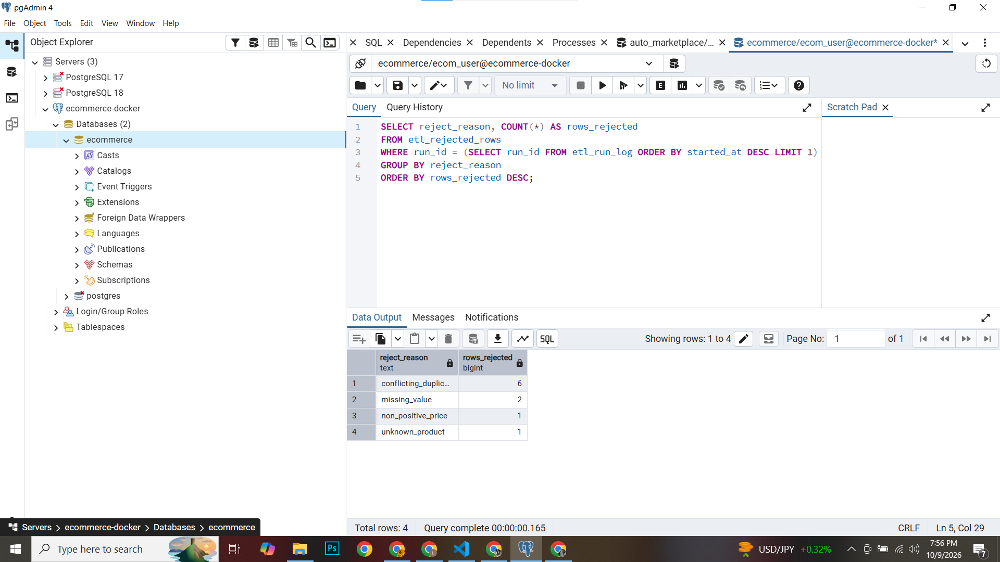
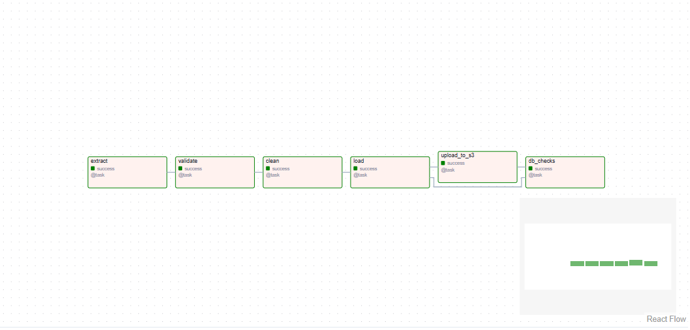
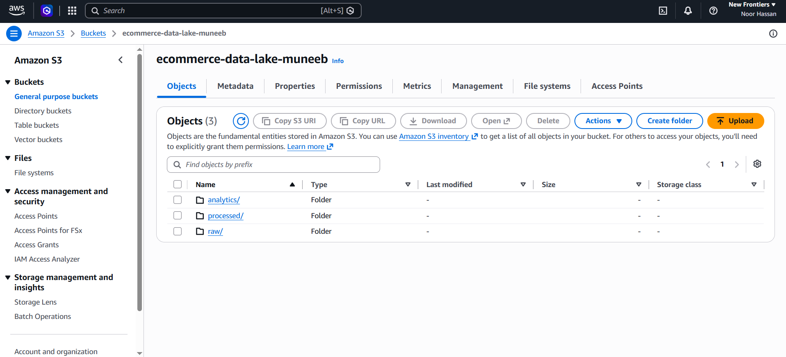

# E-Commerce Data Platform


A production-style batch data pipeline for an e-commerce domain: it ingests product price updates (CSV) and currency exchange rates (API), validates and cleans them, loads the trusted rows into PostgreSQL, keeps every rejected row with a reason, and copies each run's data to an AWS S3 data lake. The pipeline is orchestrated by Apache Airflow and runs fully in Docker.

**Stack:** Python · pandas · PostgreSQL 17 · Apache Airflow · AWS S3 (boto3) · Docker Compose · pytest · GitHub Actions

## Architecture

```
CSV price updates ──┐
                    ├─► Validate ─► Clean ─► Load ─► PostgreSQL
FX rates API ───────┘      │          │         │      ├─ product_price_history
                           │          │         │      ├─ fx_rates
                           │          └─ rejects ──────┴─ etl_rejected_rows (with reason)
                           │                            └─ etl_run_log (one row per run)
                           │
                           └─ issues reported         ─► Upload ─► AWS S3 data lake
                                                                   ├─ raw/
                                                                   └─ processed/

Orchestration: Airflow DAG (scheduler + webserver, LocalExecutor)
```

Pipeline steps live in separate modules so each can be tested on its own:

| Step | Module | What it does |
|------|--------|--------------|
| Validate | `src/transformation/validate.py` | Finds problems and reports them as `Issue` objects. Never changes data. |
| Clean | `src/transformation/clean.py` | Normalises text, converts types, drops exact duplicates, splits rows into clean and rejected. |
| Load | `src/loading/load.py` | Writes to PostgreSQL. Every function is idempotent. |
| Upload | `src/loading/s3.py` | Writes the run's raw, clean, rejected and FX data to S3, partitioned by day and run. |

## Data quality and rejected rows

Nothing is silently dropped. Every rejected row is stored in `etl_rejected_rows` with its `run_id` and a `reject_reason`:

| Reason | Meaning |
|--------|---------|
| `missing_value` | A required field is empty or could not be parsed (price, date, ...) |
| `non_positive_price` | Price is zero or negative |
| `unknown_product` | `product_id` does not exist in the products table |
| `conflicting_duplicate` | Same product and date with different prices, so all copies are rejected |

Rejected rows from the latest run:



## Idempotency

Re-running the pipeline never creates duplicates:

- `fx_rates` and `product_price_history` use `INSERT ... ON CONFLICT DO UPDATE`.
- `etl_run_log` uses `ON CONFLICT (run_id) DO UPDATE`.
- `load_rejected` deletes the rejects of the same `run_id` and source before inserting, so an Airflow retry does not double the rows. Rejects of different runs are kept as history.
- S3 keys contain the `run_id`, so uploading the same run again overwrites the same files.

## Orchestration

The Airflow DAG `ecommerce_etl` runs daily with retries and logging. It has six tasks:

`extract → validate → clean → load → upload_to_s3 → db_checks`



## Data lake (AWS S3)

Each run also writes its data to an S3 bucket, partitioned by day and by run:

```
raw/price_updates/dt=YYYY-MM-DD/run_id=<id>/product_price_updates.csv
processed/price_updates/dt=YYYY-MM-DD/run_id=<id>/clean.csv
processed/price_updates_rejected/dt=YYYY-MM-DD/run_id=<id>/rejected.csv
processed/fx_rates/dt=YYYY-MM-DD/run_id=<id>/fx_rates.csv
```

- The `run_id` is the same one stored in `etl_run_log` and `etl_rejected_rows`, so any run can be traced from the database to its files in S3.
- The bucket is private (public access blocked). Credentials are read from environment variables, never from code.
- `src/utils/s3_smoke_test.py` checks that the credentials can reach the bucket.



## Project structure

```
ecommerce-data-platform/
├── airflow/dags/          # Airflow DAG definitions
├── docker/airflow/        # Airflow image (Dockerfile)
├── sql/                   # Schema and ETL table scripts (run on first DB start)
├── src/
│   ├── ingestion/         # CSV and API readers
│   ├── transformation/    # validate.py, clean.py
│   ├── loading/           # load.py (PostgreSQL), s3.py (S3 data lake)
│   └── utils/             # DB connection, S3 smoke test
├── tests/                 # pytest unit tests
├── docs/images/           # README screenshots
├── data/                  # Local input data
├── .github/workflows/     # CI (GitHub Actions)
├── docker-compose.yml
├── .env.example
└── requirements.txt
```

## Getting started

**Requirements:** Docker Desktop, Python 3.12+, Git, and an AWS account with an S3 bucket and an IAM user (for the S3 step).

```powershell
git clone https://github.com/Muneeb0376/ecommerce-data-platform.git
cd ecommerce-data-platform

# 1. Configuration
copy .env.example .env      # then edit .env: passwords, secret key, AWS keys, bucket name

# 2. Start PostgreSQL and Airflow
docker compose up -d --build
docker compose ps
```

- Airflow UI: <http://localhost:8080> (log in with `AIRFLOW_ADMIN_USER` / `AIRFLOW_ADMIN_PASSWORD` from your `.env`)
- PostgreSQL: `localhost:<POSTGRES_PORT>` (database `ecommerce`)
- Schema scripts in `sql/` run automatically the first time the database volume is created.

Open the Airflow UI, enable the DAG and click **Trigger DAG**. To check the S3 connection on its own:

```powershell
python src/utils/s3_smoke_test.py
```

## Running the tests

```powershell
python -m venv .venv
.\.venv\Scripts\Activate.ps1
pip install -r requirements.txt
pytest -v
```

The tests cover the cleaning rules, every validation check, the database checks (with a fake connection) and the S3 helpers (with a fake client), so no running database or AWS account is needed. They also run automatically on every push through GitHub Actions.

## Useful queries

Rejected rows of the latest run:

```sql
SELECT reject_reason, COUNT(*) AS rows_rejected
FROM etl_rejected_rows
WHERE run_id = (SELECT run_id FROM etl_run_log ORDER BY started_at DESC LIMIT 1)
GROUP BY reject_reason
ORDER BY rows_rejected DESC;
```

Run history:

```sql
SELECT run_id, status, rows_loaded, rows_rejected, message
FROM etl_run_log
ORDER BY started_at DESC
LIMIT 5;
```

## Security

Secrets (database passwords, Airflow secret key, AWS access keys) are read from environment variables. `.env` is git-ignored and only `.env.example` with placeholders is committed. The IAM user used by the pipeline is separate from the AWS root account.

## Roadmap

- [x] Python + PostgreSQL + ETL with data-quality checks
- [x] Airflow orchestration in Docker
- [x] Unit tests and CI (GitHub Actions)
- [x] AWS S3 data lake (raw / processed)
- [ ] PySpark processing
- [ ] Data warehouse (star schema) and Power BI dashboards
- [ ] Kafka and Spark Streaming for real-time events